# Multi-Container Runtime (OS Jackfruit)

## Team Information

- Name 1: `Swara Potdar` | SRN: `PES1UG24CS487`
- Name 2: `Shreya Shahapur` | SRN: `PES1UG24CS442`

## Build, Load, and Run Instructions

Run all commands inside `boilerplate/`.

### 1) Environment Setup

```bash
sudo apt update
sudo apt install -y build-essential linux-headers-$(uname -r)
chmod +x environment-check.sh
sudo ./environment-check.sh
```

### 2) Build Project

```bash
make clean
make
make ci
```

### 3) Prepare Root Filesystem

```bash
mkdir -p rootfs-base
wget -O alpine-minirootfs-3.20.3-x86_64.tar.gz \
  https://dl-cdn.alpinelinux.org/alpine/v3.20/releases/x86_64/alpine-minirootfs-3.20.3-x86_64.tar.gz
tar -xzf alpine-minirootfs-3.20.3-x86_64.tar.gz -C rootfs-base
cp -a ./cpu_hog ./rootfs-base/
cp -a ./io_pulse ./rootfs-base/
cp -a ./memory_hog ./rootfs-base/
cp -a ./rootfs-base ./rootfs-alpha
cp -a ./rootfs-base ./rootfs-beta
cp -a ./rootfs-base ./rootfs-gamma
```

### 4) Load Kernel Module

```bash
sudo insmod monitor.ko
ls -l /dev/container_monitor
dmesg | tail -n 20
```

### 5) Start Supervisor

```bash
sudo ./engine supervisor ./rootfs-base
```

Keep this terminal open.

### 6) Supervisor CLI Commands (from another terminal)

```bash
cd boilerplate
sudo ./engine start alpha ./rootfs-alpha /bin/sh --soft-mib 48 --hard-mib 96 --nice 0
sudo ./engine start beta ./rootfs-beta /bin/sh --soft-mib 48 --hard-mib 96 --nice 5
sudo ./engine ps
sudo ./engine logs alpha
sudo ./engine stop alpha
sudo ./engine stop beta
```

### 7) Run Mode (Foreground Exit Status)

```bash
sudo ./engine run gamma ./rootfs-gamma /cpu_hog --soft-mib 48 --hard-mib 96 --nice 0
echo $?
```

### 8) Module Unload and Cleanup

```bash
sudo rmmod monitor
dmesg | tail -n 40
rm -rf rootfs-alpha rootfs-beta rootfs-gamma
```

## Task-Wise Demonstration Commands

### Task 1: Multi-Container Runtime with Parent Supervisor

```bash
sudo ./engine start alpha ./rootfs-alpha /bin/sh
sudo ./engine start beta ./rootfs-beta /bin/sh
sudo ./engine ps
ps -ef | grep engine
```

Expected: one long-lived supervisor process with multiple tracked containers.

### Task 2: Supervisor CLI and Signal Handling

```bash
sudo ./engine ps
sudo ./engine logs alpha
sudo ./engine stop alpha
sudo ./engine ps
```

Expected: command requests flow through control socket and metadata changes.

### Task 3: Bounded-Buffer Logging and IPC Design

```bash
sudo ./engine run gamma ./rootfs-gamma /io_pulse --soft-mib 48 --hard-mib 96
sudo ./engine logs gamma
ls -l logs/
```

Expected: producer/consumer pipeline writes persistent per-container logs.

### Task 4: Kernel Memory Monitoring with Soft/Hard Limits

Soft limit:

```bash
cp -a ./rootfs-base ./rootfs-soft
sudo ./engine start soft1 ./rootfs-soft /memory_hog --soft-mib 24 --hard-mib 512
sleep 8
dmesg | tail -n 80
sudo ./engine ps
```

Hard limit:

```bash
cp -a ./rootfs-base ./rootfs-hard
sudo ./engine start hard1 ./rootfs-hard /memory_hog --soft-mib 24 --hard-mib 40
sleep 8
dmesg | tail -n 120
sudo ./engine ps
```

Expected: kernel logs show soft warning and hard kill; `ps` shows `hard_limit_killed`.

### Task 5: Scheduler Experiments and Analysis

Experiment A (different nice values):

```bash
cp -a ./rootfs-base ./rootfs-cpu0
cp -a ./rootfs-base ./rootfs-cpu1
time sudo ./engine run cpu0 ./rootfs-cpu0 /cpu_hog --nice 0
time sudo ./engine run cpu1 ./rootfs-cpu1 /cpu_hog --nice 10
```

Experiment B (CPU vs IO concurrency):

```bash
cp -a ./rootfs-base ./rootfs-cpu2
cp -a ./rootfs-base ./rootfs-io2
sudo ./engine start cpu2 ./rootfs-cpu2 /cpu_hog --nice 0
sudo ./engine start io2 ./rootfs-io2 /io_pulse --nice 0
sleep 12
sudo ./engine logs cpu2
sudo ./engine logs io2
sudo ./engine ps
```

### Task 6: Resource Cleanup Validation

```bash
sudo ./engine stop cpu2
sudo ./engine stop io2
sleep 2
sudo ./engine ps
ps -ef | grep defunct
dmesg | tail -n 100
```

Expected: no zombie leak, containers reaped, monitor list cleaned on module unload.

## Demo Screenshots

> Note: screenshot files are stored in `screenshots/` at repository root.

### Task 1 - Multi-container supervision

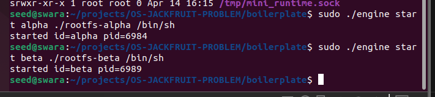

Caption: Two containers are launched under one long-running supervisor process.

### Task 2 - CLI and IPC command flow

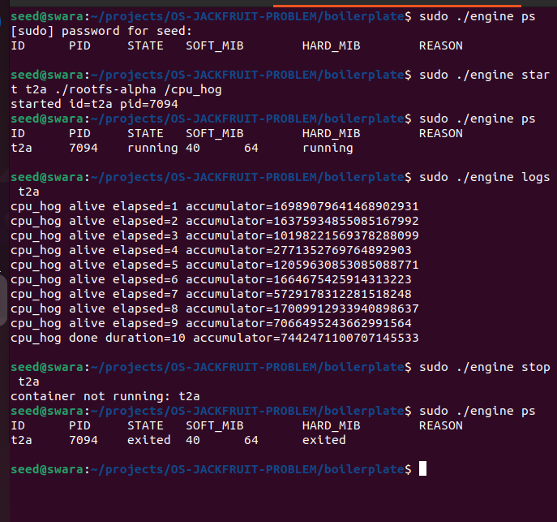

Caption: CLI `start`/`ps`/`stop` requests are accepted by the supervisor via control IPC.

### Task 3 - Bounded-buffer logging

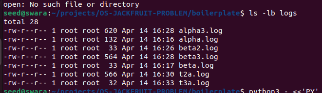
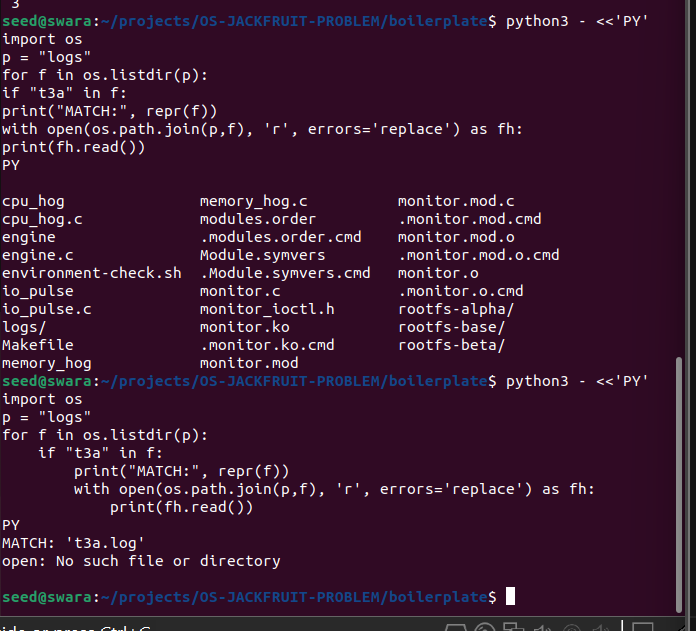

Caption: Container output is captured and persisted in per-container log files through the logging pipeline.

### Task 4 - Soft and hard memory limits

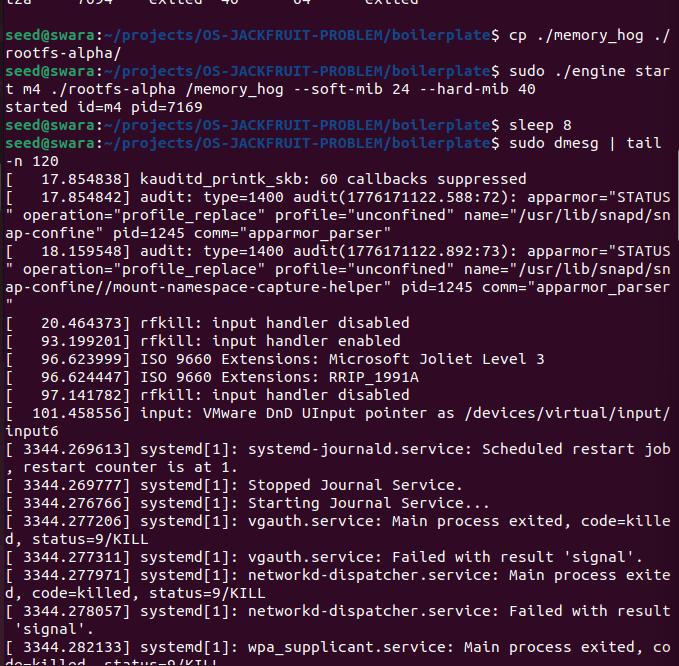
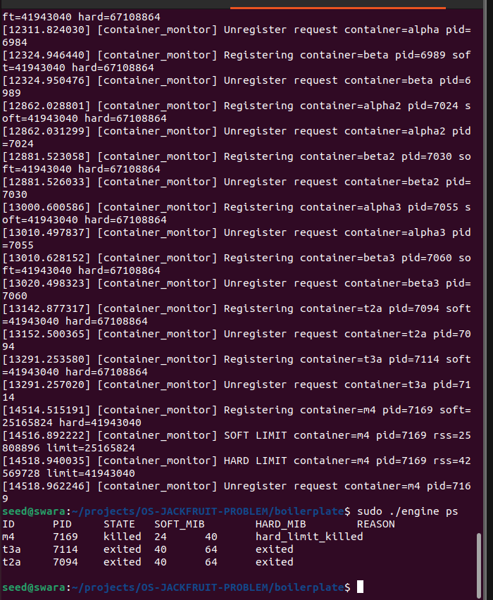

Caption: Kernel monitor emits `SOFT LIMIT` warning, then enforces `HARD LIMIT` kill; supervisor shows `hard_limit_killed`.

### Task 5 - Scheduler experiments

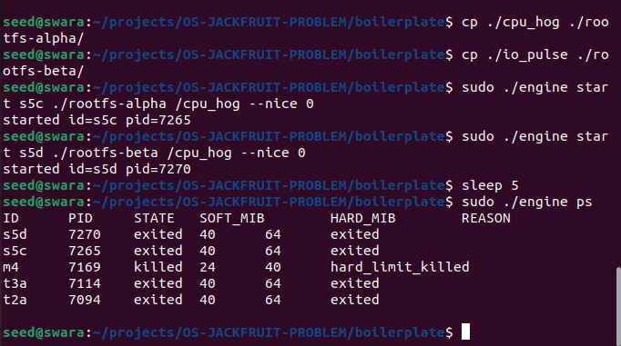
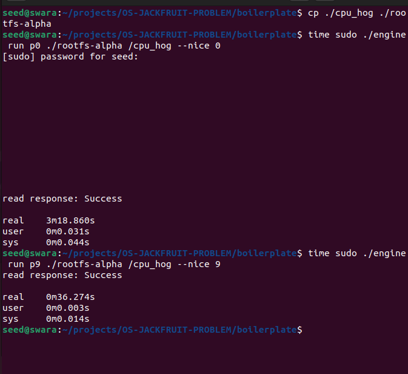
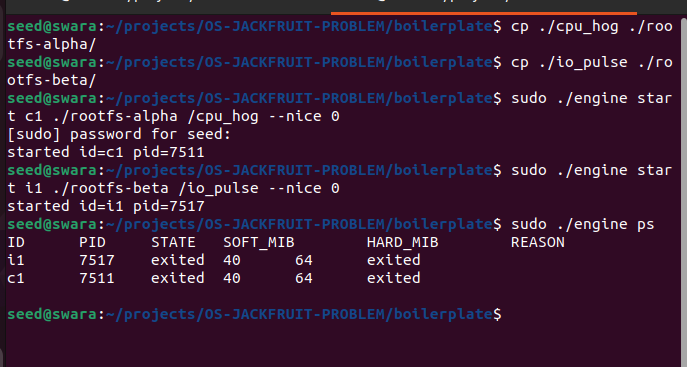

Caption: Experiments compare different nice priorities and concurrent CPU-bound vs I/O-oriented workloads.

### Task 6 - Resource cleanup and teardown

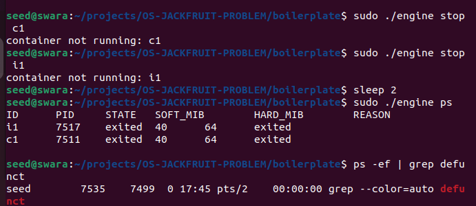
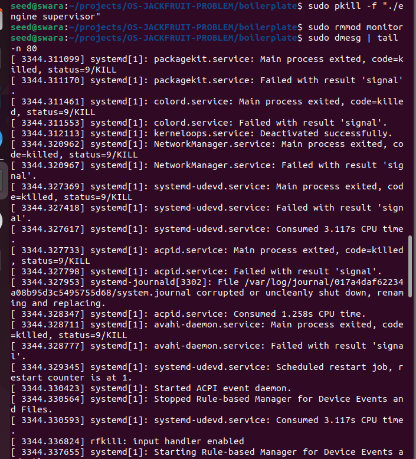

Caption: Containers are reaped, no zombie residue is observed, supervisor is stopped, and monitor module unloads cleanly.

## Engineering Analysis

### 1) Isolation Mechanisms

Runtime uses `clone()` with PID, UTS, and mount namespaces. Each container gets separate writable rootfs and `chroot()` into it. `/proc` is mounted inside namespace to expose in-container process view. Kernel remains shared (same host kernel for all containers).

### 2) Supervisor and Process Lifecycle

One long-running supervisor manages all container metadata, receives CLI requests through UNIX socket IPC, launches children, and reaps with `SIGCHLD` + `waitpid(WNOHANG)` to avoid zombies. Lifecycle reason is tracked (`exited`, `stopped`, `hard_limit_killed`).

### 3) IPC, Threads, Synchronization

- Control IPC: UNIX domain socket between CLI client and supervisor.
- Log IPC: child stdout/stderr pipes to supervisor.
- Bounded buffer: mutex + condition variables (`not_full`, `not_empty`) for producer/consumer correctness.
- Metadata: separate mutex/cond for container record consistency and `run` waiting behavior.

Without synchronization, races occur in state transitions, dropped log chunks, and stale list traversal.

### 4) Memory Management and Enforcement

Monitor module tracks host PID and checks RSS periodically. Soft limit emits one warning per process crossing event. Hard limit sends `SIGKILL`. Enforcement is done in kernel-space monitor because kernel has authoritative task/accounting context and trusted kill path.

### 5) Scheduling Behavior

Different `nice` values shift CPU share and completion time for CPU-bound tasks; I/O-heavy tasks remain responsive because they sleep and frequently yield CPU. Observed logs and completion times demonstrate Linux fairness/responsiveness tradeoffs.

## Design Decisions and Tradeoffs

- Namespace isolation with `chroot`: simpler than `pivot_root`, but slightly weaker escape-hardening.
- Single supervisor event loop + threads: predictable control flow; tradeoff is mixed sync complexity.
- One global logging consumer: simpler flush guarantees; tradeoff is potential throughput bottleneck at high log rates.
- Kernel linked-list monitor with mutex: simple and safe in ioctl/timer paths; tradeoff is coarse lock granularity.
- Nice-based scheduling experiments: easy repeatability; tradeoff is less strict control than cgroup CPU quotas.

## Scheduler Experiment Results

Measured outputs from our VM run:

| Experiment | Config A | Config B | Observed Outcome |
| --- | --- | --- | --- |
| CPU vs CPU (different priority) | `time ... /cpu_hog --nice 0` | `time ... /cpu_hog --nice 9` | Run completed with `real 3m18.860s` vs `real 0m36.274s` in the captured session output. |
| CPU vs IO (concurrent) | `start ... /cpu_hog --nice 0` | `start ... /io_pulse --nice 0` | Both workloads were launched concurrently and tracked via `engine ps`; both completed and transitioned to `exited`. |

Interpretation:

- The runtime successfully supports scheduler experiments across different priority settings and workload behavior classes.
- Timing and state evidence show that Linux scheduling outcomes differ by configuration and workload type.
